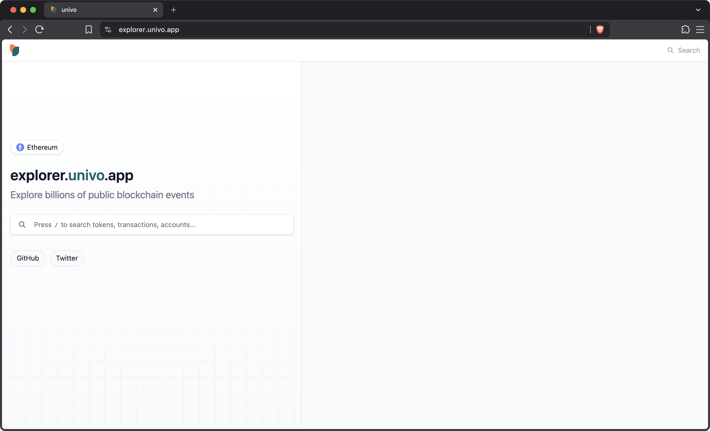

<h1 align="center">univo explorer</h1>

A fast, simple, open-source block explorer for EVM chains

## Mission

We believe humanity needs a fundamentally simple open-source view of the events that take place on public blockchains. This explorer serves to provide that interface by indexing important events across the major EVM blockchains.

## Technology

- [univo](https://univo.app)

The blazing-fast, developer friendly blockchain indexing software that serves as the foundation upon which this block explorer is built. univo provides fast, simple, and affordable indexing that makes complex blockchain applications not only possible but easy to build and operate. Its design is the culmination of years of building and maintaining indexers across the ecosystem. We recommend you check out its [documentation](https://univo.app/docs) and use it to power your own applications - if it can handle explorer scale it can handle your scale.

- [React](https://react.dev/)
- [Tanstack Start](https://tanstack.com/start/latest)

Our frontend is built with React and Tanstack Start. The app is designed as a Single Page Application (SPA) but also makes heavy use of React Server Components (RSC) to compose and render events.

- [Postgres](https://www.postgresql.org/)
- [Cloudflare R2](https://www.cloudflare.com/products/r2)
- [Cloudflare Workers](https://www.cloudflare.com/products/workers)

Our backend is powered by Postgres for event storage, R2 for indexing metadata, and Workers to serve our frontend globally.

## License

The univo explorer is MIT-licensed open-source software.